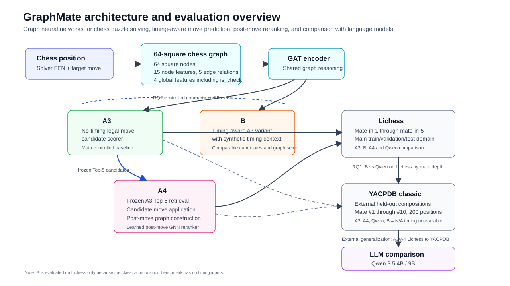

# GraphMate

[English](README.md) | [Italiano](README.it.md)

GraphMate is a chess graph-neural-network research repository for chess puzzle solving, timing-aware move prediction, post-move reranking, and comparison with language models. It builds PyTorch Geometric graph representations from Lichess mate-in-1..5 puzzles, evaluates a frozen family of GNN/GAT models, compares them with local LLM baselines, and measures external generalization on a frozen YACPDB classic-composition benchmark.

The experimental phase is complete. The checked-in documentation and final analysis are intended to make the frozen results auditable without retraining models or mutating official artifacts.



A3 and B form the controlled no-timing/timing comparison, while A4 tests whether explicit post-move graph reasoning can improve ranking over frozen A3 Top-5 retrieval.

## Research Questions

RQ1 asks where the timed GNN provides better move guidance than selected local LLM baselines. The literal timed comparison is evaluated on Lichess, where timing features exist.

RQ2 asks whether adding the implemented synthetic timing signal improves over the matched no-timing GNN baseline. The controlled comparison is Model B against Model A3.

YACPDB classic is used separately as an external generalization benchmark for A3, A4, and LLMs. Model B is not evaluated there because human timing is unavailable.

## Key Results

| Setting | Model / Baseline | Top-1 |
| --- | --- | ---: |
| Lichess official test | A3 legal-candidate scorer | 67.561% |
| Lichess official test | B timing-aware A3 variant | 65.981% |
| Lichess official test | A4 A3 Top-5 post-move reranker | 85.412% |
| Lichess strict UCI | Qwen 3.5 4B | 0.070% |
| Lichess strict UCI | Qwen 3.5 9B | 0.116% |
| YACPDB classic | A3 | 11.0% |
| YACPDB classic | A4 | 15.5% |
| YACPDB classic | Qwen 3.5 4B | 0.0% |
| YACPDB classic | Qwen 3.5 9B | 0.5% |

The controlled RQ2 timing ablation did not support a timing benefit: Model B scored 1.580 percentage points below A3 on the aligned Lichess comparison (`n01=321`, `n10=457`, exact two-sided McNemar/binomial `p=1.2238376595768834e-06`). The bounded conclusion is that the implemented synthetic timing signal did not improve predictive performance relative to the matched no-timing A3 baseline.

External generalization drops sharply from Lichess to YACPDB classic: A3 moves from 67.561% to 11.0%, and A4 from 85.412% to 15.5%. The analysis treats this as a distribution shift result, not as a claim that one benchmark is objectively harder.

## Model Family

| Model | Description | Status |
| --- | --- | --- |
| A | Global-vocabulary no-timing GAT classifier | Frozen historical baseline |
| A1 | Best-legal inference mode over Model A | Diagnostic mode, no independent checkpoint |
| A2 | Legal-masked global-vocabulary GAT classifier | Frozen baseline |
| A3 | Legal-move candidate scorer without timing | Frozen official no-timing baseline |
| B | A3-controlled timing-aware variant | Frozen timing ablation |
| A4 | A3 Top-5 post-move GNN reranker | Frozen best GNN |

## Graph Representation

Each chess position is represented as a `torch_geometric.data.Data` object with 64 board-square nodes.

Node features have dimension 15: piece type one-hot (`pawn`, `knight`, `bishop`, `rook`, `queen`, `king`), color, occupied, row, column, attacked-by-white, attacked-by-black, legal mobility, pinned status, and piece value.

Edges use a 5-dimensional multilabel representation: legal move, attack, defend, pin, and check line. Global features are side to move, check status, normalized fullmove number, and normalized halfmove clock.

For Lichess puzzles, the solver position is obtained by applying `Moves[0]` to `OriginalFEN`; the target is `Moves[1]`. The models predict the next move from the solver position, not a full autonomous mate line.

## Data And Timing

The main training and test distribution is Lichess mate-in-1..5. The final CSV split contains 68,958 training, 8,620 validation, and 8,620 test puzzles. The move vocabulary is built exclusively from the training split. Eight validation targets and ten test targets are out of vocabulary, leaving 8,612 validation and 8,610 test graphs in the PyG datasets used by the frozen graph-model evaluations.

Model B uses synthetic, rating-conditioned timing features: previous move time, original move time, and a `time_is_synthetic` indicator. These are not human think-time measurements.

The external benchmark is `yacpdb_classic_v1`, a frozen set of 200 YACPDB directmate compositions with 20 problems per mate depth from #1 through #10. Accepted-key scoring is used for classic compositions.

## LLM Baselines

The primary LLM baselines are local `qwen3.5:4b` and `qwen3.5:9b` runs. Strict UCI parsing is the primary metric; relaxed parsing is diagnostic only. GPT-OSS attempts are documented but excluded from the primary comparison because protocol, reasoning, and truncation behavior made them unsuitable for the final strict accuracy table.

## Repository Structure

```text
src/                         # data, graph, model, training, inference, evaluation, analysis code
tests/                       # unit and integration tests
checkpoints/                 # final frozen distributable checkpoints
resources/move_encoder/      # checked-in canonical move vocabulary
generic_info/                # public technical notes and final reports
generic_info/final_analysis/ # canonical generated final analysis tables, figures, summary
data/                        # local data root, mostly ignored
artifacts/                   # local experiment outputs, ignored
TimeGNN-main/                # external upstream code, kept separate
```

See [generic_info/README.md](generic_info/README.md), [checkpoints/README.md](checkpoints/README.md), and [resources/README.md](resources/README.md) for more detail.

## Installation

```bash
python -m venv venv
./venv/bin/python -m pip install --upgrade pip
./venv/bin/python -m pip install -r requirements.txt
```

PyTorch installation can be platform-specific, especially when CUDA wheels are required. If the generic `requirements.txt` install is not suitable for your machine, install the matching PyTorch/PyG wheels first and then install the remaining requirements.

## Data Preparation

The historical all-in-one Lichess pipeline entry point is:

```bash
./venv/bin/python main.py
```

Representation validation can be inspected with:

```bash
./venv/bin/python -m src.validation.representations --help
```

Frozen final results should be reproduced from the existing artifacts and checkpoints rather than by rebuilding datasets casually.

## Training

Training entry points remain available for reproducibility and extension:

```bash
./venv/bin/python -m src.cli.training.train_model_a3_legal_scorer --help
./venv/bin/python -m src.cli.training.train_model_b_timing_legal_scorer --help
./venv/bin/python -m src.cli.training.train_model_a4_postmove --help
```

The public results in this repository use the frozen checkpoints under [checkpoints/](checkpoints/). Training is not required to inspect the final analysis.

## Evaluation

Representative evaluation entry points:

```bash
./venv/bin/python -m src.cli.evaluation.evaluate_model_a_vs_a2_vs_a3 --help
./venv/bin/python -m src.cli.evaluation.evaluate_model_b_timing_ablation --help
./venv/bin/python -m src.cli.evaluation.evaluate_model_a3_vs_a4 --help
./venv/bin/python -m src.cli.evaluation.evaluate_classic_heldout --help
./venv/bin/python -m src.cli.evaluation.benchmark_llm_chess --help
```

Use the command help before launching an evaluation, because some commands expect local data or ignored artifact paths that are not part of the public Git checkout.

## Final Analysis

The canonical public analysis is under [generic_info/final_analysis/](generic_info/final_analysis/):

- [final_experiment_summary.md](generic_info/final_analysis/final_experiment_summary.md) is the generated scientific summary.
- [final_experiment_analysis.md](generic_info/final_analysis/final_experiment_analysis.md) explains source selection, statistics, exclusions, and limitations.
- `data/` contains machine-readable tables and statistical outputs.
- `figures/` contains generated SVG and PNG figures.

Regeneration entry point:

```bash
./venv/bin/python -m src.cli.analysis.build_final_experiment_report --help
```

## Checkpoints And Resources

Frozen model checkpoints are documented in [checkpoints/README.md](checkpoints/README.md). The canonical move vocabulary is documented in [resources/README.md](resources/README.md).

Do not write training outputs into `checkpoints/`; keep trial and raw experiment artifacts under ignored local artifact directories.

## Limitations

The timing experiment uses synthetic timing features, so it does not answer whether real human think-time would help. YACPDB per-depth buckets are small (`N=20`), so depth-level intervals are wide. The LLM comparison measures strict move-output behavior under the documented protocol and should not be read as a broad benchmark of general chess ability.

## License And Citation

This repository is released under the [MIT License](LICENSE). If you use GraphMate before formal citation metadata is added, cite the repository and the final analysis summary.

## Acknowledgements

GraphMate uses public chess puzzle and composition sources, PyTorch Geometric infrastructure, and local open model baselines. External upstream code under `TimeGNN-main/` is kept separate from the GraphMate implementation.
